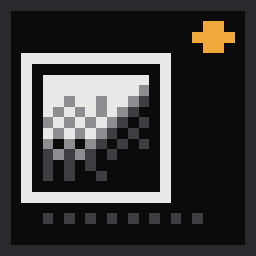
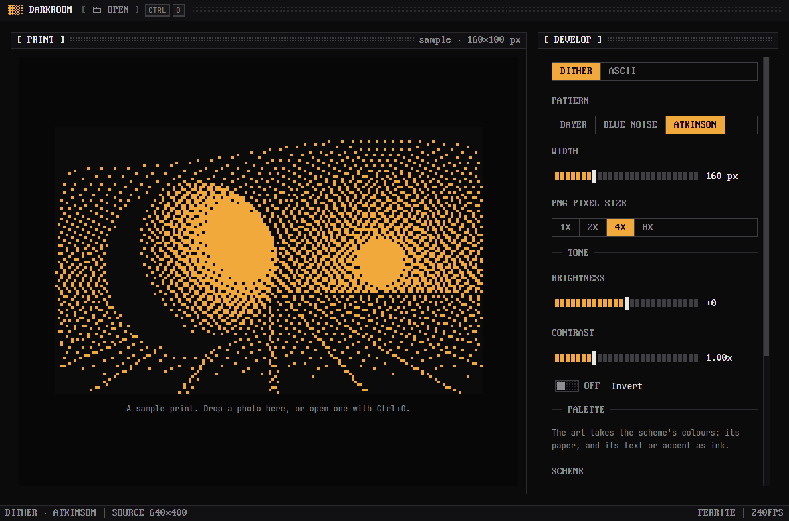

<p align="center">
  
</p>

<h1 align="center">Darkroom</h1>

<p align="center">
  A <a href="https://github.com/rwetz/ferrite-design">Ferrite</a> dither studio:
  turn a photo into pixel art or ASCII, in twenty algorithms and any palette, and export it.
</p>

<p align="center">
  <a href="https://github.com/rwetz/ferrite-darkroom/actions/workflows/ci.yml"></a>
  <a href="https://github.com/rwetz/ferrite-darkroom/releases/latest"></a>
  <a href="LICENSE"></a>
</p>



Darkroom turns photos into dithered pixel art. Drop an image on the window
and develop it with any of twenty algorithms, from Floyd–Steinberg and
Atkinson to Bayer matrices, blue noise and a halftone dot, or as ASCII with
ferrite-design's glyph-fitted character sets. The art takes the colours of
whichever Ferrite scheme you pick (amber on iron, phosphor green, cyanotype
blue) or a preset palette: Game Boy, Commodore 64, ZX Spectrum, CMYK and
more. Export a PNG or a text file. It's how you make splash art
and icons for every other Ferrite app.

It's a native desktop app built with [GPUI](https://gpui.rs) and
[ferrite-design](https://github.com/rwetz/ferrite-design): amber on iron,
0px corners, pixel type and stepped motion. It runs no webview.

## Features

- **Bring a photo.** Drop it on the print, open one with
  <kbd>Ctrl</kbd>+<kbd>O</kbd>, or pass a path: `ferrite-darkroom photo.jpg`.
  PNG, JPEG, GIF, BMP and WebP. A built-in sample print is there to start.
- **Dither.** Twenty algorithms, at 32 to 480 pixels wide:
  - *Error diffusion:* Floyd–Steinberg, Atkinson, Jarvis–Judice–Ninke,
    Stucki, Burkes, Sierra, Sierra two-row, Sierra Lite, False
    Floyd–Steinberg, Shiau–Fan and Shiau–Fan 2, with a serpentine switch.
  - *Ordered:* Bayer 2×2, 4×4, 8×8 and 16×16, blue noise, interleaved
    gradient noise, an 8×8 halftone dot, random, and plain threshold.
  - *Strength* from 0 (flat posterise) to 200% (crunchy), and a
    *threshold* that moves where ink starts.
  The preview draws whole device pixels per art pixel, so it's exactly the
  export.
- **ASCII.** All thirteen of ferrite-design's character sets, from classic
  `.:-=+*#%@` to box drawing and the "best character" set, fitted by shape
  (edges) or by tone (brightness), 20 to 200 characters wide.
- **Tone.** Brightness, contrast, gamma and invert.
- **Palette.** *Scheme* inks the art in the scheme's text or accent colour
  on its background (light appearance gives dark ink on light paper). Or
  pick a preset: Black & white, RGB, CMYK, 3-bit, Game Boy, Teletext,
  Apple II, Commodore 64, ZX Spectrum, 6-bit RGB, 2-bit grey, Vaporwave
  or Hacker. Colours are matched in Oklab (as the eye sees) or RGB, and a
  palette without a true black or white still gets the photo's whole tonal
  range. Two-colour palettes dither by lightness, so any ink on any paper
  keeps every tone.
- **Pixels as shapes.** Draw each pixel as a square, circle, diamond or plus,
  with a gutter between them, dots that swell with the light (*size by
  tone*), a choice of which colour is the paper, transparent paper for PNGs,
  and a lattice of dots over the bare paper. It's how you get halftone dot
  grids and LED-board looks. Shapes show once a pixel is 3 px or more: in
  the preview, and in 4× and 8× PNGs.
- **Compare and contact sheet.** *Compare* puts the photo left of a split
  and the art right of it. *Contact sheet* shows the print through all
  twenty algorithms, or every palette, side by side; click one to use it.
- **Undo.** <kbd>Ctrl</kbd>+<kbd>Z</kbd> and <kbd>Ctrl</kbd>+<kbd>Shift</kbd>+<kbd>Z</kbd>
  (or <kbd>Ctrl</kbd>+<kbd>Y</kbd>) step through every change to the
  recipe; a slider drag undoes in one step.
- **Your own palettes.** Import one from [Lospec](https://lospec.com/palette-list)
  or anywhere else: `.hex`, GIMP `.gpl`, JASC `.pal`, paint.net `.txt`, or a
  palette image (its distinct colours). Or copy hex colours from anywhere and
  *Paste hex*. Dropping a palette file on the print imports it too.
- **Recipes.** Everything about how a print develops (algorithm, palette,
  tone, sizes) saves as a small TOML file (<kbd>Ctrl</kbd>+<kbd>S</kbd>).
  Open one (<kbd>Ctrl</kbd>+<kbd>Shift</kbd>+<kbd>O</kbd>, or drop it on the
  print) to develop any photo the same way. Five come in `recipes/`:
  Game Boy, newsprint halftone, a seven-colour sunset, an engraving, and
  a dot lattice.
- **Export.** A PNG in the palette's exact colours at 1×, 2×, 4× or 8× pixel size
  (<kbd>Ctrl</kbd>+<kbd>E</kbd>), the ASCII as a text file
  (<kbd>Ctrl</kbd>+<kbd>Shift</kbd>+<kbd>E</kbd>), or the ASCII copied to the
  clipboard (<kbd>Ctrl</kbd>+<kbd>Shift</kbd>+<kbd>C</kbd>).
- **Ferrite throughout.** Ten color schemes, a command palette
  (<kbd>Ctrl</kbd>+<kbd>Shift</kbd>+<kbd>P</kbd>) with every algorithm,
  palette and character set in it, and a CRT switch-off when you close the window.

## Install

### Download

Prebuilt binaries for Windows, macOS and Linux are attached to each
[release](https://github.com/rwetz/ferrite-darkroom/releases/latest).
Unpack the archive and run `ferrite-darkroom`. Nothing else is needed.

### From source

```bash
git clone https://github.com/rwetz/ferrite-darkroom
cd ferrite-darkroom
cargo run --release
```

On Linux you need the usual GPUI development packages first:

```bash
sudo apt install libxkbcommon-dev libxkbcommon-x11-dev libwayland-dev libxcb1-dev libfontconfig-dev
```

On macOS with Xcode 27 or later, install the Metal toolchain once:

```bash
xcodebuild -downloadComponent MetalToolchain
```

## Configuration

Darkroom remembers the look and the last recipe you used, as plain
`key = value` lines (a recipe file uses the same keys, in TOML):

| OS | Settings |
|---|---|
| Windows | `%APPDATA%\ferrite\darkroom.conf` |
| macOS | `~/Library/Application Support/ferrite/darkroom.conf` |
| Linux | `$XDG_CONFIG_HOME/ferrite/darkroom.conf` (or `~/.config/…`) |

```ini
scheme = ferrite      # ferrite mono graphite slate concrete harbor cyanotype phosphor verdigris bruise
appearance = dark     # dark | light | system: the paper
mode = dither         # dither | ascii
algorithm = atkinson  # floyd-steinberg atkinson jarvis-judice-ninke stucki burkes sierra sierra-two-row
                      # sierra-lite false-floyd-steinberg shiau-fan shiau-fan-2 bayer-2 bayer bayer-8
                      # bayer-16 blue-noise gradient-noise halftone random threshold
palette = scheme      # scheme bw rgb cmyk 3-bit gameboy teletext apple-ii c64 zx-spectrum 6-bit
                      # 2-bit-grey vaporwave hacker custom
colors = 0f380f 306230 8bac0f 9bbc0f   # palette = custom: its colours
strength = 1.00       # 0 to 2
bias = 0.00           # -1 to 1: the threshold
serpentine = true     # error diffusion alternates direction per row
match = oklab         # oklab | rgb
seed = 1              # for algorithm = random
cols = 160            # dither width in pixels
scale = 4             # PNG pixel size
shape = square        # square | circle | diamond | plus
gutter = 0.00         # 0 to 0.9: gap between pixels
modulate = false      # size by tone
paper = first         # first | darkest | lightest: the palette colour shapes sit on
transparent = false   # leave the paper transparent in PNGs
lattice = 0.00        # 0 to 1: dots over the bare paper
brightness = 0.00     # -1 to 1
contrast = 1.00       # 0.25 to 3
gamma = 1.00          # 0.2 to 5
invert = false
ink = accent          # accent | text: the Scheme palette's ink
charset = best-character
fit = shape           # shape | tone
ascii_cols = 80
```

`FERRITE_*` variables (the shared look from
[Lodestone](https://github.com/rwetz/ferrite-lodestone)) win over the saved
scheme and appearance.

## With Lodestone

[Lodestone](https://github.com/rwetz/ferrite-lodestone) launches Ferrite apps
from their **source checkouts**: it scans a folder for crates that depend on
ferrite-design, runs `cargo build`, and starts the result with its shared
look. To see Darkroom there, clone this repo next to Lodestone (or into the
folder you point Lodestone at) and have a Rust toolchain on your `PATH`:

```
Dev/
├── ferrite-lodestone/
└── ferrite-darkroom/  # appears as a tile in Lodestone
```

A downloaded Darkroom binary runs fine on its own, but Lodestone doesn't
discover installed binaries.

## Development

```bash
cargo test                    # every algorithm and palette, colour, tone, PNG export, ASCII, settings
cargo clippy --all-targets
```

- `src/engine.rs`: the dither engine: every algorithm, Oklab colour
  matching, palette mapping. Pure and unit-tested.
- `src/palettes.rs`: the preset palettes and palette-file import.
- `src/recipe.rs`: the recipe, read and written as settings lines or TOML.
- `src/render.rs`: how art pixels are drawn (shapes, gutter, paper,
  lattice) for the preview and PNGs, and the compare view's "before".
- `recipes/`: example recipes; tests check each one loads.
- `src/studio.rs`: the process around it: loading, the working print,
  adjustments, PNG and preview pixels, ASCII. Pure and unit-tested; the
  preview and the exports both run it.
- `docs/ROADMAP.md`: where Darkroom is going (GIFs, masks, layers, an
  ASCII engine).
- `src/settings.rs`: the settings file.
- `src/main.rs`: the view. It follows ferrite-design's
  [AGENTS.md](https://github.com/rwetz/ferrite-design/blob/main/AGENTS.md).

On Windows, `build.rs` embeds `assets/logo.ico` as the executable and window
icon. The `.ico` is generated from `assets/logo.svg`, so regenerate it when
the logo changes.

## License

Apache-2.0, see [LICENSE](LICENSE). The binary embeds fonts from
ferrite-design under their own licenses; see [NOTICE](NOTICE).
